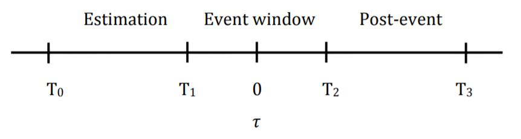

# eventstudySuite
Interactive data exploration and stock price predictions based on news and company events

<!---[First equation](https://latex.codecogs.com/gif.latex?\dpi{400}\alpha&space;+&space;\frac{2\beta}{\gamma})--->

<!---[Second equation](http://latex.codecogs.com/gif.latex?%5Cfrac%7Ba%7D%7Bb%7D)--->

<!---[Third equation](https://latex.codecogs.com/svg.latex?\sum_{i=1}^{n}sqrt(3sin(i)))--->

<!---[Third equation](https://latex.codecogs.com/gif.latex?\dpi{200}\sum_{i=1}^{n}\sqrt(3sin(i)))--->

<!---[alt1](https://wikimedia.org/api/rest_v1/media/math/render/svg/583cca32cbdd337bcc4b07c5748fb2ba2c1184c8)--->

## Event windows
Below is an example of an **event window**, here for the interesting event category of *FINANCIAL REPORT*, indicating the profitable strategy of buying the day ahead of a company's financial presentation.

